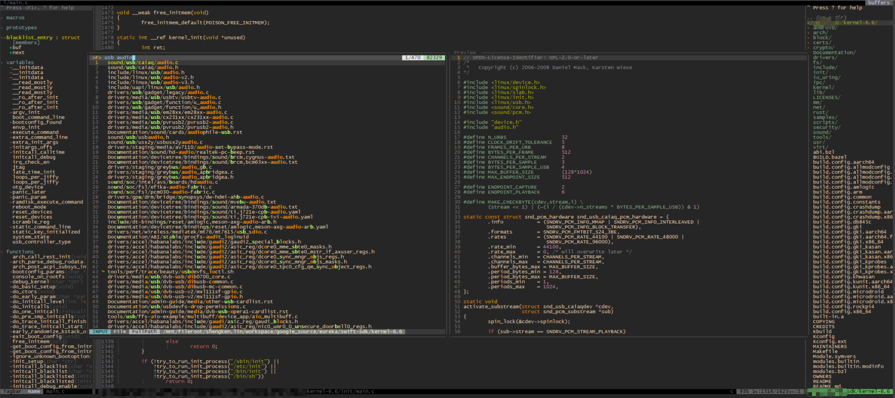

# README



> **使用指南可直接参考：[user-guide](./user-guide.md)**

## All Plug include

> **总结一款 simple-vim 插件配置，满足日常工作**，已经删除其他不常用的插件，配置文件中基本都有中文注释。

```sh
Plugin 'VundleVim/Vundle.vim'
Plugin 'majutsushi/tagbar'
Plugin 'scrooloose/nerdtree'
Plugin 'vim-airline/vim-airline'
Plugin 'vim-airline/vim-airline-themes'
Plugin 'mhinz/vim-startify'   " 输入 vim 显示图案好看
Plugin 'tomasr/molokai'
Plugin 'flazz/vim-colorschemes'
Plugin 'rking/ag'
Plugin 'neoclide/coc.nvim'
```

## 设置代理

避免下载速度过慢，可以提前设置一下 git + repo + wget + curl 的代理

```sh
# For Linux
local_proxy="127.0.0.1:10809"
git config --global http.proxy http://$local_proxy
git config --global https.proxy http://$local_proxy
export http_proxy=$local_proxy
export https_proxy=$local_proxy
echo "proxy = $local_proxy" > $HOME/.curlrc
```

## 插件使用

### 使用 Vundle 管理插件

```sh
git clone https://github.com/VundleVim/Vundle.vim.git ~/.vim/bundle/Vundle.vim
# 默认安装在/.vim/bundle/vundle下
```

插件有三种类型:
- 1. Github上vim-scripts仓库的插件
- 2. Github上非vim-scripts仓库的插件
- 3. 不在Github上的插件

对于不同的插件，vundle自动管理和下载插件的时候，有不同的地址填写方法，有如下三类：

- 1. 在Github上vim-scripts用户下的仓库,只需要写出repos（仓库）名称
- 2. 在Github其他用户下的repos, 需要写出”用户名/repos名”
- 3. 不在Github上的插件，需要写出git全路径

可以在终端通过 vim 打开 `~/.vimrc` 文件

配置 vundle 插件：

```
set nocompatible              " 去除VI一致性,必须要添加
filetype off                  " 必须要添加

" Vundle 插件管理器设置
set rtp+=~/.vim/bundle/Vundle.vim
call vundle#begin()
" 在此处添加您需要安装的插件
Plugin 'VundleVim/Vundle.vim'
Plugin 'majutsushi/tagbar'
Plugin 'scrooloose/nerdtree'
Plugin 'vim-airline/vim-airline'
Plugin 'vim-airline/vim-airline-themes'
Plugin 'mhinz/vim-startify'         " 输入 vim 显示图案好看
Plugin 'tomasr/molokai'
Plugin 'flazz/vim-colorschemes'
Plugin 'neoclide/coc.nvim'
call vundle#end()
filetype plugin indent on

" 忽视插件改变缩进,可以使用以下配置
" filetype plugin on

" 常用的命令
" :PluginList       - 列出所有已配置的插件
" :PluginInstall     - 安装插件,追加 `!` 用以更新或使用 :PluginUpdate
" :PluginSearch foo - 搜索 foo ; 追加 `!` 清除本地缓存
" :PluginClean      - 清除未使用插件,需要确认; 追加 `!` 自动批准移除未使用插件
```


- 当然也可以不使用任何插件管理的插件， 比如

```
set runtimepath^=~/.vim/bundle/ag
```

### 搜索插件 ag

sudo apt-get install silversearcher-ag

- 下載源码

- github: https://github.com/ggreer/the_silver_searcher
- reelase: https://geoff.greer.fm/ag/

```sh
wget https://geoff.greer.fm/ag/releases/the_silver_searcher-2.2.0.tar.gz
tar zxf the_silver_searcher-2.2.0.tar.gz
cd the_silver_searcher-2.2.0

sudo apt install liblzma-dev
./configure --prefix=$PWD/output
make ; make install
# 加入环境变量
```

- 使用

```
ag -i xxxxx					搜索忽略大小写
ag -A xxxxx     			搜索显示行号
ag -B 2 "root" /etc/passwd  并显示匹配内容之前的n行文本
ag -C 2 PATTERN			搜索含PATTERN文本，并同时显示匹配内容以及它前后各n行文本的内容。
ag -w PATTERN			 全匹配搜索，只搜索与所搜内容完全匹配的文本。
ag --ignore-dir /etc/ "kenlin"  	忽略某些文件目录进行搜索。
```

命令使用参考 ：https://blog.csdn.net/weixin_39789796/article/details/117462856

#### vim 配置 ag

```
set runtimepath^=~/.vim/bundle/ag

nmap ag :Ag -w <C-R>=expand("<cword>")<CR><CR>   "Ag 查找当成层级
```


### Vim 标签列举插件 - Tagbar

> 详情请看 [Github 主页](https://github.com/preservim/tagbar)

- tagbar 默认安装在$HOME`/.vim/bundle/`路径下

```sh
git clone https://github.com/preservim/tagbar $HOME/.vim/bundle/tagbar
```

- 配置

```
let g:tagbar_ctags_bin='/usr/bin/ctags'          "ctags程序的路径

"let g:tagbar_left=1                     "显示在左边, 或者使用下面的配置
let g:tagbar_position = 'left'        " top, bottom, left, right

let g:tagbar_width=30                    "窗口宽度的设置

" 1 开启自动预览(随着光标在标签上的移动，顶部会出现一个实时的预览窗口)
let g:tagbar_autopreview = 0

let g:tagbar_autofocus = 0  " 光标在文件内

" 设置快捷键 ctrl+n
map <C-n> :Tagbar<CR>

"autocmd BufReadPost *.cpp,*.c,*.h,*.hpp,*.cc,*.cxx call tagbar#autoopen() "如果是c语言的程序的话 tagbar 自动打开
```

### Vim 主题配色插件 - Colorschemes

> 详情请看 [Github](https://github.com/flazz/vim-colorschemes.git)

Colorschemes 默认安装在$HOME `.vim/bundle/` 路径下

```sh
 git clone https://github.com/flazz/vim-colorschemes.git $HOME/.vim/bundle/colorschemes
```

在 `$HOME/.vimrc` 中，添加以下内容

```
Plugin 'flazz/vim-colorschemes'


" More themes, please check $HOME/.vim/bundle/colorschemes/colors
"
" When ssh Session is SecureCRT
" Session Options
"   -> Terminal
"     -> Emulation
"     select Terminal     - "Xterm"
"     select Color Mode   - "ANSI with 256color"
"     [x]                 - Use color scheme

set t_Co=256                        " "设置256色彩"
set background=dark
colorscheme molokai                 " Select vim color theme

" 我比较喜欢这个主题
colorscheme gruvbox
" 解决 git commit 注释信息看不清问题
autocmd BufRead COMMIT_EDITMSG,HEAD,FETCH_HEAD,config colorscheme evening
```

### 文件目录插件 nerdtree

- 配置

```
Plugin 'scrooloose/nerdtree'


" 快捷键
map <C-b> :NERDTreeToggle<CR>

let NERDTreeWinPos='right'

" autocmd vimenter * NERDTree  "自动开启Nerdtree  文件列表
" wincmd w   " 自动打开后光标在代码区
" autocmd VimEnter * wincmd w

let g:NERDTreeWinSize=28  " 目录栏宽度

"打开vim时如果没有文件自动打开NERDTree
""autocmd vimenter * if !argc()|NERDTree|endi

"当NERDTree为剩下的唯一窗口时自动关闭
autocmd bufenter * if (winnr("$") == 1 && exists("b:NERDTree") && b:NERDTree.isTabTree()) | q | endif

let NERDTreeIgnore = ['\.pyc$','\.o', '\.ko', '\.bin', '\.out']  " 过滤所有.pyc文件不显示
let g:NERDTreeHidden=0     "不显示隐藏文件
" 图标
let g:NERDTreeIndicatorMapCustom = {
    \ "Modified"  : "✹",
    \ "Staged"    : "✚",
    \ "Untracked" : "✭",
    \ "Renamed"   : "➜",
    \ "Unmerged"  : "═",
    \ "Deleted"   : "✖",
    \ "Dirty"     : "✗",
    \ "Clean"     : "✔︎",
    \ 'Ignored'   : '☒',
    \ "Unknown"   : "?"
    \ }
```

- 快捷键使用

```sh
#  打开和关闭
ctrl + b

ctrl + w + h    光标 focus 左侧树形目录
ctrl + w + l    光标 focus 右侧文件显示窗口
ctrl + w + w    光标自动在左右侧窗口切换
ctrl + w + r    移动当前窗口的布局位置

clrl + w + 方向键，左右窗口切换

o       在已有窗口中打开文件、目录或书签，并跳到该窗口
go      在已有窗口 中打开文件、目录或书签，但不跳到该窗口
t       在新 Tab 中打开选中文件/书签，并跳到新 Tab
T       在新 Tab 中打开选中文件/书签，但不跳到新 Tab
i       split 一个新窗口打开选中文件，并跳到该窗口
gi      split 一个新窗口打开选中文件，但不跳到该窗口
s       vsplit 一个新窗口打开选中文件，并跳到该窗口
gs      vsplit 一个新 窗口打开选中文件，但不跳到该窗口
!       执行当前文件
O       递归打开选中 结点下的所有目录
m    文件操作：复制、删除、移动等
```

### 状态栏插件 airline

状态栏插件能够使得vim界面更加简洁美观，方便在多个文件中进行切换

```
Plugin 'vim-airline/vim-airline'
Plugin 'vim-airline/vim-airline-themes'

"let g:airline_powerline_fonts=1  " 我的服务器没有 powerline
" powerline 字体： https://github.com/powerline/fonts

let g:airline_section_b = '%-0.10{getcwd()}'
" let g:airline_section_c = '%t'  " 只显示文件名
let g:airline_section_c = "%{expand('%:p')}"  " 显示全路径
let g:airline#extensions#tagbar#enabled = 1
let g:airline_section_y = ''
let g:airline_theme='google_dark'
```

### 代码跳转插件 global + ctag

#### ctag

- 安装 ctags

sudo apt-get install ctags

- 源码编译

```sh
git clone https://github.com/universal-ctags/ctags.git
# git reset --hard be5b1fc65e537093a6f1ec339b04bb45d044b980 (这里验证ok)
cd ctags
./autogen.sh
./configure --prefix=$PWD/output
make -j8
make install
# 加入环境变量
```

-  使用 ctags

在源码目录下执行： `ctags -R` ，然后会生成一个 tags 文件，其实这个 tags 文件就是你的编码的所有文件的索引（比如变量索引，函数索引）。

最后在 `.vimrc` 下写入： `set tags=[your_path]./tags`, 或者在 vim 下直接执行 `：set tags=./tags ` 临时设置

> 不过还有一个小瑕疵, 你修改程序后, 比如增加了函数定义, 删除了变量定义, tags文件不能自动rebuild, 你必须手动再运行一下命令: `ctags -R`

不过，ctags -R 有个问题，成员变量没有包含在里面。所以自动完成对象的成员时没有提示。

解决办法：

```
ctags -R --fields=+iaS --extra=+q *
```

- 在创建ctags的时候排除某些目录

ctags -R --exclude=pattern

ctags -R --exclude=hifi4_framework/*

或者将所有需要排除的目录都写在一个文件 exclude_file 里，然后 ctags -R --exclude=@exclude_file

- 指定文件夹和文件类型

ctags -R --languages=c,c++ /path/to/folder1 /path/to/folder2

- 函数变量查找

- 命令模式下  CTRL+] 跳转到函数或者变量

- 查找完毕返回到当前：CTRL+t 或者 crtl+o

#### global

>  详情： [主页](https://www.gnu.org/software/global/)
>
> https://ftp.gnu.org/pub/gnu/global/

```sh
# 下载
# 以下命令中的-O和-符号分别表示从标准输出和标准输入中读取和写入数据
wget  https://ftp.gnu.org/pub/gnu/global/global-6.6.8.tar.gz
tar -zxf global-6.6.8.tar.gz
cd global-6.6.8

# - 编译
./configure --prefix=$PWD/output
make -j8
make install

# 配置环境变量
export PATH=$HOME/simple-vim/tools/global-6.6.8/output/bin:$PATH
```

- 配置和快捷键

```
let GtagsCscope_Auto_Load = 1       " auto loading
let GtagsCscope_Auto_Map = 1        " To use the default key/mouse mapping
let GtagsCscope_Quiet = 1           " Do not display error message

if filereadable("tags")
    execute 'set tags=tags'
endif

if filereadable(".tags")
    execute 'set tags=.tags'
endif

if filereadable("cscope.out")
    cs add cscope.out
endif

if has("cscope")
    set csprg="gtags-cscope"
    "set csprg="/usr/bin/cscope"
    set csto=1  " csto的值决定了 cstag 执行查找的顺序。假如csto被设置为0，那么 cscope 数据将会被优先查找
    set cst "始终同时查找cscope数据库和tags文件
endif

set cscopetag " 使用 cscope 作为 tags 命令,  Enable 'CTRL-]' shortcuts

set cscopeprg=gtags-cscope
cs add GTAGS

" cscope
" Find symbol       :cs find 0 or s
nmap ccs :cs find s <C-R>=expand("<cword>")<CR><CR>
" Find definition   :cs find 1 or g
nmap ccg :cs find g <C-R>=expand("<cword>")<CR><CR>
" Find functions called by this function  (gtags not implemented)
nmap ccd :cs find d <C-R>=expand("<cword>")<CR><CR>
" Find reference    :cs find 3 or c
nmap ccc :cs find c <C-R>=expand("<cword>")<CR><CR>
```

### coc 代码补全

https://github.com/neoclide/coc.nvim

- 下载-编译-安装

Coc 默认安装在$HOME `.vim/bundle/` 路径下

> 注意 vim 版本需要8.1 版本以上才行
> vim 8.0 缺少了一些vim关键字

如果服务器没安装 yarn, 且无管理员权限，可以安装在本地

```sh
# - 编译 (NodeJs > v16.17)
# 下载编译安装 nodejs 最后将其加入环境变量即可 -- 自己网络搜索安装
sudo apt install nodejs

# - 下载
git clone https://github.com/neoclide/coc.nvim $HOME/.vim/bundle/coc.nvim

# 安装 yarn
cd $HOME/.vim/bundle/coc.nvim
npm install yarn@latest
./node_modules/yarn/bin/yarn install
./node_modules/yarn/bin/yarn build

yarn config set ignore-engines true

# 如果 yarn install 很慢，手动指定下淘宝源 , 再重试
# 使用淘宝源
./node_modules/yarn/bin/yarn config set registry 'https://registry.npm.taobao.org'
# 还原回去
./node_modules/yarn/bin/yarn config set registry 'https://registry.yarnpkg.com'
# 再重新 yarn install ; yarn build


# - 打开VIM, 输入以下命令, 安装 Coc 插件.
# C++ 提示插件
$ :CocInstall coc-clangd coc-vimlsp
:CocCommand clangd.install

# 配置相关环境变量(这里配置的clangd是14.0.3)
$ echo "export PATH=\${PATH}:${HOME}/.config/coc/extensions/coc-clangd-data/install/14.0.3/clangd_14.0.3/bin" >> /home/${USER}/.bashrc
```

> **注意插件安装位置**：~/.config

- 写 python 提示插件

安装插件依赖

```sh
pip3 install python-language-server[all]
# 安装插件
:CocInstall coc-pyright
```

- 參考： https://www.jianshu.com/p/9a5e9f1571d8

- https://blog.csdn.net/m0_70748381/article/details/126929463


- 配置

```
let g:coc_disable_startup_warning = 0  " 打开
" For coc-nvim, it can't use pumvisible, and it will cause some side effect.
"  More details: please visit
"  https://github.com/neoclide/coc.nvim/wiki/Completion-with-sources
"  "" wiki: https://github.com/neoclide/coc.nvim/wiki
"
"" <Enter>         : final select
" <Tab>           : select next
"  <"Shift> + <Tab> : Select prev
inoremap <expr> <cr> coc#pum#visible() ? coc#pum#confirm() : "\<CR>"
inoremap <expr> <Tab> coc#pum#visible() ? coc#pum#next(1) : "\<Tab>"
inoremap <expr> <S-Tab> coc#pum#visible() ? coc#pum#prev(1) : "\<S-Tab>"

set pumheight=12  " 补全菜单太长
```

- 关闭函数参数中变量名提示

```
:CocConfig

输入
{
    "inlayHint.enable": false
}
```

具体配置餐参考：build/index.js

## LeaderF 模糊搜索插件

[Github](https://github.com/Yggdroot/LeaderF)

要求：

- vim7.3 or higher. Only support 7.4.1126+ after v1.01.
- Python2.7+ or Python3.1+.
- To use the popup mode, neovim 0.5.0+ or vim 8.1.1615+ are required.

```sh
git clone https://github.com/Yggdroot/LeaderF.git

# 注意路径：
.vim/bundle/LeaderF
```

- 在 vimrc 中加上

```
set rtp+=~/.vim/bundle/Vundle.vim
call vundle#begin()
Plugin 'Yggdroot/LeaderF' "LeaderF模糊查找插件
call vundle#end()
filetype plugin indent on

然后下载 LeaderF
:PluginInstall
```

- 快捷键

```
<C-C>, <ESC> : 退出
<C-R> : 在模糊查询和正则表达式模式间切换
<C-F> : 在全路径搜索和名字搜索模式间切换
<Tab> : 切换成normal模式
<C-V>, <S-Insert> : 从剪切板里copy字符串进行查询
<C-U> : 清除已经打出的字符
<C-J>, <C-K> : 在结果列表中移动
<Up>, <Down> : 从历史记录里调出上一次/下一次的输入pattern
<2-LeftMouse> or <CR> : 打开在光标处的文件或者被选择的多个文件
<F5>  : 刷新缓存
<C-P> : 预览选中结果
<C-Up> : 在预览popup窗口里滚动向上
<C-Down> : 在预览popup窗口里滚动向下
```

- 如果报错

```
LeaderF requires Vim compiled with python and/or a compatible python version.
```

检查你的 python 版本，建议使用 python3

然后检查你 vim 是否支持 Python

```
vim --version | grep +python

如果不支持，建议重新编译 vim
./configure --with-features=huge --prefix=$HOME/simple-vim/vim-9.0/ --enable-gui=gtk3 --with-tlib=ncursesw --enable-pythoninterp=yes  --enable-python3interp=yes
```

> 参考：https://retzzz.github.io/dc9af5aa/

## markdown

```sh
cd ~/.vim/bundle
git clone https://github.com/tamlok/vim-markdown.git

Plugin 'tamlok/vim-markdown'

# 下载
:PluginInstall
```


## 其他配置

### 设置切换目录快捷键

尤其是在使用 ag 搜索的时候，可以切换到当前文件路径，只在当前路径下搜索

```
" 设置是否进入当前打开文件的目录(set autochdir), 快捷键按 \ 然后按 cd
nnoremap <leader>cd :call ToggleAutochdir()<CR>
" 全局变量用于存储原始工作目
let g:original_cwd = getcwd()
function! ToggleAutochdir()
    if &acd
        set noacd
        execute 'cd ' . g:original_cwd
        echo "禁用自动切换工作目录"
    else
        set acd
        echo "启用自动切换工作目录"
    endif
endfunction
```

- 其他的可以参考我的 vimrc : https://github.com/kenlin-00/kendall-simple-vim/blob/master/vimrc


## 重新安装 vim

### 手动编译安装（推荐）

- 安装libncurses5-dev，否则编译时会报no terminal library found错误：

```sh
sudo apt install libncurses5-dev
```

- 由于这里要添加python支持，所以要装python3-dev(或者python-dev，对于python2用户)，否则编译时报Python.h: No such file or directory错误：

如果没有 python3

```sh
sudo apt-get install python3-dev
```

- vim 官网： https://github.com/vim/vim.git

- 克隆Vim源代码

```sh
git clone https://github.com/vim/vim.git
```

- 直接下 8.2 载源码

```sh
wget https://ftp.nluug.nl/pub/vim/unix/vim-8.2.tar.bz2

tar -xf vim-8.2.tar.bz2

cd vim-8.2
```

- 编译

```sh
# 自己修改输出路径
./configure --with-features=huge --prefix=$HOME//simple-vim/tools/vim82/output/ --enable-gui=gtk3 --with-tlib=ncursesw --enable-pythoninterp=yes  --enable-python3interp=yes

# –with-features=huge：支持最大特性
# –enable-rubyinterp：打开对ruby编写的插件的支持
# –enable-pythoninterp：打开对python编写的插件的支持
# –enable-python3interp：打开对python3编写的插件的支持
# –enable-luainterp：打开对lua编写的插件的支持
# –enable-perlinterp：打开对perl编写的插件的支持
# –enable-multibyte：打开多字节支持，可以在Vim中输入中文
# –enable-cscope：打开对cscope的支持
# –with-python-config-dir=/usr/lib/python2.7/config-x86_64-linux-gnu/ 指定python config路径
# –with-python-config-dir=/usr/lib/python3.5/config-3.5m-x86_64-linux-gnu/ 指定python3 config路径(根据自己系统实际情况配置)
# –prefix=/usr：指定将要安装到的路径(可自行创建)
# –enable-gui：GUI支持，可用auto、gtk2或者gnome

make -j4
make install
```

### 使用 apt 安装

或者 sudo apt upgrade vim

## 使用 simple-vim

- 备份和新增 vimrc 配置

> vimrc 配置见文末

```sh
mv ~/.vim ~/vim-bak
mv ~/.vimrc ~/vimrc-bak

ln -s ~/simple-vim/vim ~/.vim
ln -s ~/simple-vim/vimrc ~/.vimrc
```

- 通过 Vundle 下载插件

建议翻墙再下载，或者直接从我这拷贝已经下载好的插件

```sh
vim
:PluginInstall  # 下载
:PluginList  # 列出所有插件
```

- 一切准备就绪后可以使用 run-gtags.sh 在 your-project-source-core 下生成索引文件


## vimrc

[vimrc配置文件](https://github.com/kendall-cpp/kendall-simple-vim/blob/master/vimrc)

> **以上配置说明仅仅是参考，vimrc 配置会不定期更新，具体见 vimrc**
